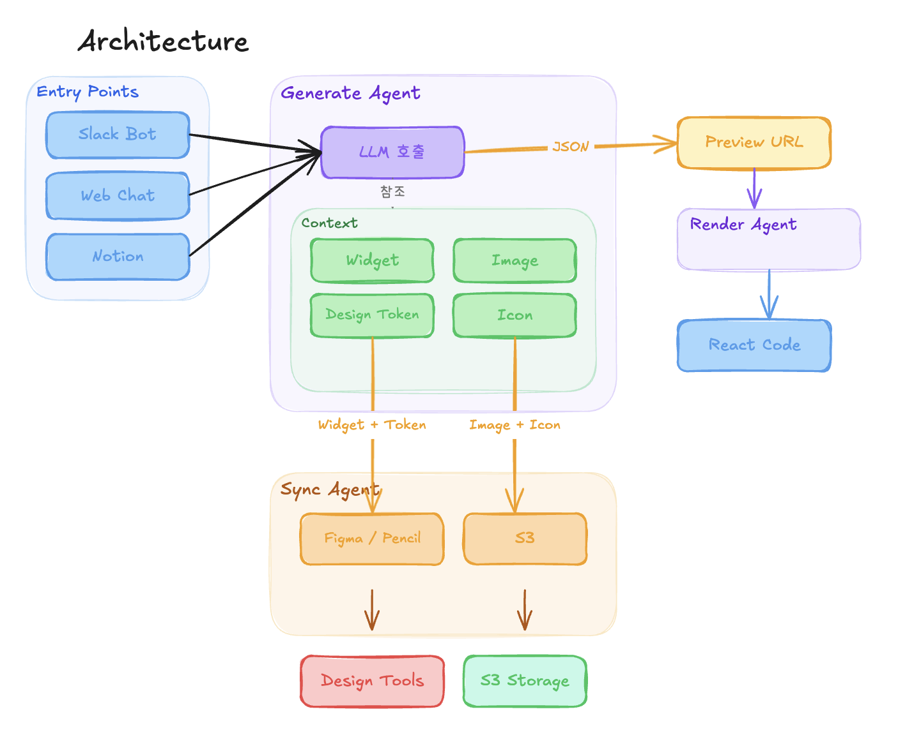

# A2UI - Agent-Generated UI

A2UI 개념 기반의 **자연어 → UI JSON 생성 → 런타임 렌더링** 서비스.
Slack bot과 웹 Visual Editor를 통해 자연어로 UI를 만들고, 실시간으로 편집할 수 있습니다.

## 시스템 아키텍처



```
┌─────────────────────────────────────────────────────────────────────┐
│                         사용자 진입점                                │
│                                                                     │
│    ┌──────────────┐                    ┌──────────────────┐         │
│    │  Slack 채널   │                    │  웹 브라우저       │         │
│    │              │                    │                  │         │
│    │  /agui 로그인 │                    │  Visual Editor   │         │
│    │   폼 만들어줘 │                    │  + Chat 패널      │         │
│    └──────┬───────┘                    └────────┬─────────┘         │
│           │                                     │                   │
└───────────┼─────────────────────────────────────┼───────────────────┘
            │                                     │
            ▼                                     ▼
┌──────────────────┐              ┌──────────────────────────────────┐
│                  │              │       Frontend (React 19)        │
│   Slack Bot      │              │                                  │
│   (slack-bolt)   │              │  ┌────────┐ ┌──────┐ ┌───────┐  │
│                  │              │  │Zustand  │ │A2UI  │ │Chat   │  │
│  자연어 수신      │              │  │Store    │ │렌더러 │ │+ Log  │  │
│  → 백엔드 호출    │              │  │(불변성) │ │(12개  │ │패널   │  │
│  → 미리보기 URL   │              │  │undo/    │ │위젯)  │ │       │  │
│    Slack에 전송   │              │  │redo     │ │       │ │       │  │
│                  │              │  └────┬───┘ └───┬──┘ └───┬───┘  │
└────────┬─────────┘              │       │         │        │       │
         │                        └───────┼─────────┼────────┼───────┘
         │                                │         │        │
         │         ┌──────────────────────┘         │        │
         │         │  REST API (JSON)               │        │
         │         │  + SSE (스트리밍)               │        │
         ▼         ▼                                │        │
┌────────────────────────────────────────────────────────────────────┐
│                     Backend (FastAPI)                               │
│                                                                    │
│  ┌─────────────────────────────────────────────────────────────┐   │
│  │                    API Layer                                 │   │
│  │                                                             │   │
│  │  POST /api/generate        ← 자연어 → A2UI JSON (SSE)      │   │
│  │  POST /api/generate/edit   ← 위젯 선택 + 자연어 수정 (SSE)  │   │
│  │  CRUD /api/projects        ← 프로젝트 저장/조회              │   │
│  │  CRUD /api/tokens          ← 디자인 토큰 관리               │   │
│  │  CRUD /api/assets          ← 이미지/아이콘 에셋             │   │
│  │  CRUD /api/templates       ← 위젯 템플릿                   │   │
│  │  GET  /api/preview/:id     ← 미리보기 (Slack 공유)          │   │
│  └─────────┬───────────────────────────────┬───────────────────┘   │
│            │                               │                       │
│            ▼                               ▼                       │
│  ┌──────────────────┐           ┌────────────────────┐             │
│  │  LLM Service     │           │  SQLite + SQLAlchemy│             │
│  │                  │           │                    │             │
│  │  Claude SDK      │           │  projects          │             │
│  │  (anthropic)     │           │  design_tokens     │             │
│  │                  │           │  assets            │             │
│  │  System Prompt:  │           │  widget_templates  │             │
│  │  A2UI 스키마     │           │                    │             │
│  │  + 컴포넌트      │           │  파일시스템:        │             │
│  │    카탈로그       │           │  이미지/아이콘 저장  │             │
│  └────────┬─────────┘           └────────────────────┘             │
│           │                                                        │
└───────────┼────────────────────────────────────────────────────────┘
            │
            ▼
┌──────────────────┐
│   Claude API     │
│   (Anthropic)    │
│                  │
│  자연어 입력      │
│  → A2UI JSON     │
│    스트리밍 생성   │
└──────────────────┘
```

## 핵심 데이터 흐름

### 1. 자연어 → UI 생성

```
사용자: "로그인 폼 만들어줘"
    │
    ▼
[Frontend Chat] ──POST──▶ [Backend /api/generate]
                              │
                              ▼
                         [LLM Service]
                         System Prompt + 자연어
                              │
                              ▼
                         [Claude API] ──SSE 스트리밍──▶
                              │
                    ┌─────────┴─────────┐
                    ▼                   ▼
              [SSE chunk 이벤트]   [SSE done 이벤트]
              Chat에 실시간 표시   A2UI JSON 완성
                                        │
                                        ▼
                                  [EditorStore]
                                  document 업데이트
                                        │
                                        ▼
                                  [A2UI Renderer]
                                  JSON → React 컴포넌트
                                  캔버스에 렌더링
```

### 2. 위젯 선택 → 자연어 수정

```
캔버스에서 버튼 클릭
    │
    ▼
[EditorStore] selectedWidgetId = "btn-1"
    │
    ├──▶ [속성 패널] Style/Props 편집 표시
    │
    └──▶ [Chat] "선택된 위젯을 수정하세요..." 플레이스홀더
              │
              │  "이 버튼 색상을 빨간색으로"
              ▼
         POST /api/generate/edit
         { prompt, selectedWidgetId: "btn-1", currentDocument }
              │
              ▼
         [Claude] 해당 위젯만 수정한 JSON 반환
              │
              ▼
         [EditorStore] 불변 병합 → 리렌더링
         (undo 가능)
```

### 3. Slack Bot 흐름

```
Slack: /agui 대시보드 만들어줘
    │
    ▼
[Slack Bot] ──POST /api/generate──▶ [Backend]
    │                                    │
    │                               Claude SSE 수집
    │                                    │
    │          ◀── A2UI JSON ────────────┘
    │
    ├──POST /api/projects (저장)
    │
    └──Slack 메시지: "UI 생성 완료! 미리보기: http://localhost:5173/preview/abc123"
```

## A2UI 확장 JSON 스키마

```json
{
  "version": "0.1.0",
  "designTokens": {
    "colors": { "primary": "#3B82F6" },
    "spacing": { "md": "16px" },
    "typography": { "heading": { "fontSize": "24px" } },
    "borderRadius": { "md": "8px" }
  },
  "components": [
    {
      "id": "card-1",
      "type": "card",
      "children": ["title-1", "btn-1"],
      "style": { "padding": "$spacing.md" }
    },
    {
      "id": "title-1",
      "type": "text",
      "props": { "content": "제목", "variant": "heading" }
    },
    {
      "id": "btn-1",
      "type": "button",
      "props": { "label": "클릭" },
      "style": { "background": "$colors.primary" }
    }
  ]
}
```

**지원 컴포넌트:** card, text, button, text-field, select, checkbox, image, icon, divider, container, grid, stack

**토큰 참조:** `$colors.primary`, `$spacing.md` 형태로 designTokens 값을 참조

## 워크플로우 시스템

인터랙티브 위젯(button, text-field, select, checkbox)에 워크플로우를 설정하여 사용자 액션을 정의합니다.
코드 추출 시 워크플로우 정보를 기반으로 실제 동작하는 React 코드를 생성합니다.

```
┌─────────────────────────────────────────────────────────┐
│  위젯 선택 (button, text-field, select, checkbox)       │
│                                                         │
│  ┌─────────────────────────────────────────────────┐    │
│  │  Properties 패널 (우측)                          │    │
│  │                                                 │    │
│  │  Props    ─ label, placeholder 등                │    │
│  │  Style    ─ 색상, 크기, 레이아웃                  │    │
│  │  Workflow ─ 트리거 + 액션 체인                    │    │
│  └─────────────────────────────────────────────────┘    │
└─────────────────────────────────────────────────────────┘

워크플로우 구조:
┌──────────────────────────────────────────────┐
│  Workflow                                    │
│  ├─ trigger: onClick | onChange | onSubmit    │
│  │           onBlur  | onFocus               │
│  └─ actions: [                               │
│       ├─ API 호출    (method, url, body)      │
│       ├─ 페이지 이동  (path)                  │
│       ├─ 상태 변경    (target, value)         │
│       ├─ 폼 제출     (formId)                │
│       └─ 커스텀      (description)           │
│     ]                                        │
│     액션 간 체이닝: onSuccess / onError       │
└──────────────────────────────────────────────┘
```

### 워크플로우 JSON 예시

```json
{
  "id": "submit-btn",
  "type": "button",
  "props": { "label": "로그인" },
  "workflows": [
    {
      "trigger": "onClick",
      "actions": [
        {
          "id": "action-1",
          "type": "api",
          "label": "로그인 API",
          "method": "POST",
          "url": "/api/auth/login",
          "body": "{ \"email\": \"$email\", \"password\": \"$password\" }",
          "onSuccess": "action-2",
          "onError": "action-3"
        },
        {
          "id": "action-2",
          "type": "navigate",
          "label": "대시보드 이동",
          "path": "/dashboard"
        },
        {
          "id": "action-3",
          "type": "setState",
          "label": "에러 표시",
          "target": "error-msg.visible",
          "value": "true"
        }
      ]
    }
  ]
}
```

### 코드 추출 흐름

```
하단 패널 탭:
┌──────┬─────────┬──────┬──────┐
│ Chat │ LLM Log │ JSON │ Code │
└──────┴─────────┴──────┴──────┘

JSON 탭  → A2UI JSON 원본 복사/확인
Code 탭  → React + TailwindCSS 코드 변환
           워크플로우 → 이벤트 핸들러 코드 생성
```

## 기술 스택

| 영역 | 기술 |
|------|------|
| Frontend | React 19, TypeScript, Vite, Zustand, Immer, TailwindCSS, dnd-kit, Lucide React |
| Backend | FastAPI, SQLAlchemy, SQLite, Claude SDK (anthropic), SSE-Starlette |
| Slack Bot | slack-bolt, httpx |
| 테스트 | Vitest (unit), Playwright (E2E), pytest (backend) |
| 폰트 | Plus Jakarta Sans (UI), JetBrains Mono (코드) |

## 빠른 시작

```bash
# 1. 전체 의존성 설치
npm run setup

# 2. Playwright 브라우저 설치 (E2E 테스트용)
npm run setup:playwright

# 3. 환경변수 설정
cp backend/.env.example backend/.env
# backend/.env에 AGUI_ANTHROPIC_API_KEY 설정

# 4. 개발 서버 실행 (Frontend + Backend 동시)
npm run dev

# Frontend: http://localhost:5173
# Backend:  http://localhost:8000
```

## 스크립트

| 명령어 | 설명 |
|--------|------|
| `npm run dev` | Frontend + Backend 동시 실행 |
| `npm run dev:fe` | Frontend만 실행 (port 5173) |
| `npm run dev:be` | Backend만 실행 (port 8000) |
| `npm run dev:slack` | Slack Bot 실행 (port 3000) |
| `npm run test` | 전체 테스트 (Frontend + Backend + Slack) |
| `npm run test:fe` | Frontend 단위 테스트 (Vitest) |
| `npm run test:be` | Backend 테스트 + 커버리지 (pytest) |
| `npm run test:slack` | Slack Bot 테스트 (pytest) |
| `npm run test:e2e` | E2E 테스트 (Playwright) |
| `npm run build` | Frontend 프로덕션 빌드 |
| `npm run setup` | 전체 의존성 설치 |

## 상태 관리 흐름

```
                    ┌─────────────┐
                    │ EditorStore │
                    │             │
  loadDocument() ──▶│ document    │──▶ A2UI Renderer (캔버스)
  updateWidget() ──▶│ history[]   │──▶ Widget Tree (좌측 패널)
  undo() / redo()──▶│ selectedId  │──▶ Properties (우측 패널)
                    └──────┬──────┘
                           │
         applyLLMDocument()│
                           │
                    ┌──────┴──────┐
                    │  ChatStore  │
                    │             │
  addUserMessage()─▶│ messages[]  │──▶ MessageList (채팅)
  appendToLast() ──▶│ logs[]      │──▶ LogPanel (LLM 로그)
  setStreaming() ──▶│ isStreaming  │──▶ ChatInput 비활성화
                    └─────────────┘
```

모든 상태 업데이트는 **불변(immutable)** 패턴을 따르며, EditorStore는 **undo/redo**를 지원합니다.
